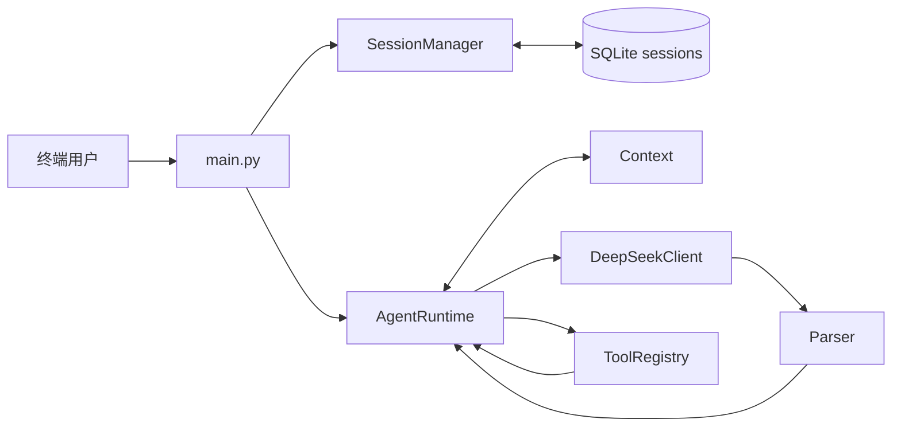
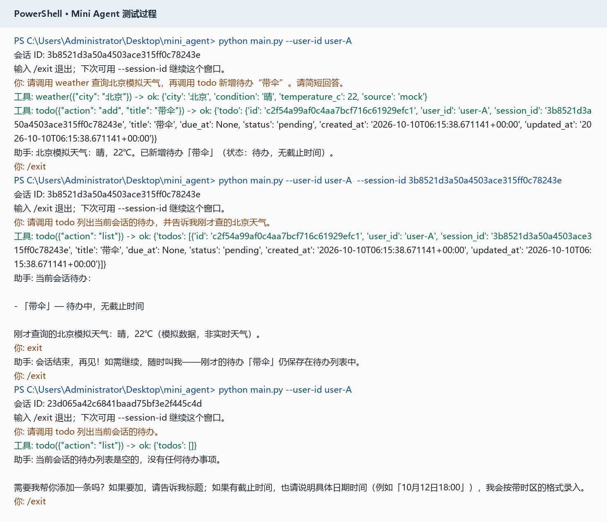

# Mini Agent

一个从零实现的命令行 Agent 示例。主循环由项目自己的 `AgentRuntime` 实现；DeepSeek 负责决定直接回答还是调用工具，OpenAI Python SDK 只用于发送请求。

## 运行

需要 Python 3.10 或更新版本，以及可用的 DeepSeek API Key。在 PowerShell 中从项目根目录运行：

```powershell
python -m venv .venv
.\.venv\Scripts\Activate.ps1
python -m pip install -r requirements.txt
$env:DEEPSEEK_API_KEY = "你的 API Key"
python main.py --user-id user-A
```

启动后会立即打印会话 ID。输入问题开始聊天，输入 `/exit` 退出。以后继续同一个会话：

```powershell
python main.py --user-id user-A --session-id 上次显示的会话ID
```

省略 `--session-id` 会新建会话，因此同一用户可以在两个终端窗口分别聊天。恢复时必须使用同一个 `--user-id` 和同一份数据库。默认数据库是 `data/sessions.db`，也可以通过 `--db` 指定：

```powershell
python main.py --user-id user-A --db data/sessions.db --docs-dir .
```

`--docs-dir` 是 `read_docs` 允许读取的目录，默认是当前工作目录。`DEEPSEEK_MODEL` 和 `DEEPSEEK_BASE_URL` 可选；代码中的默认值分别是 `deepseek-flash` 和 `https://api.deepseek.com`。API Key 只从环境变量读取，不需要写入项目文件。

运行全部测试：

```powershell
python -m unittest discover -s tests -v
```

在项目根目录使用 `-m` 运行测试。直接执行 `python tests/test_agent.py` 时，Python 可能找不到同级的 `agent` 包。

## 系统设计



| 模块 | 职责 |
| --- | --- |
| `agent/runtime.py` | 实现 Agent Loop、最大模型调用次数、工具执行记录和异常处理。 |
| `agent/llm.py` | 用 OpenAI SDK 调用 DeepSeek Chat Completions。 |
| `agent/parser.py` | 把模型回复解析为思考、工具调用或最终答案。 |
| `agent/tools.py` | 注册工具、提供 JSON Schema、检查参数并执行工具。 |
| `agent/todo.py` | 待办的增删改查、完成状态、业务校验和按窗口隔离。 |
| `agent/context.py` | 保存消息，判断何时压缩旧对话，组织发给模型的上下文。 |
| `agent/session.py` | 创建、恢复和保存独立会话。 |
| `agent/store.py` | 用 SQLite 持久化会话数据。 |
| `main.py` | 命令行交互入口。 |

每次 `run` 的流程是：

1. 接收用户输入，按用户 ID 和会话 ID 打开会话，并把输入加入 Context。
2. 把上下文和工具 Schema 发给 DeepSeek。模型可以直接回答，也可以选择工具。
3. 如果模型要求调用工具，执行工具，并用 `tool_call_id` 把结果对应回该调用；工具错误也作为结果交回模型。
4. 带着工具结果继续循环，直到模型给出最终答案或达到 `max_steps`。默认最多进行 8 次主循环模型调用，压缩摘要的独立请求不计入这个次数。

运行时提供五个工具：`calculator`、本地模拟的 `search`、`read_docs`、模拟的 `weather` 和持久化的 `todo`。`search` 不访问互联网；`weather` 只提供北京、上海、深圳的演示数据，不是实时天气。

## 待办、校验和运行状态

`todo` 支持 `add`、`list`、`update`、`complete`、`delete`。新增需要 `title`；修改、完成和删除需要 `todo_id`，模型可以先查询列表获取 ID。截止时间 `due_at` 使用带时区的日期时间，例如 `2026-10-12T18:00:00+08:00`，信息不明确时应询问用户。已完成待办不能再编辑，重复完成不会新增待办。

工具执行前通过 `jsonschema` 检查类型、必填项、额外字段、嵌套字段、枚举、长度和数值范围；日期时间还检查时区和日历合法性。业务层再检查空白标题、操作对应参数、待办是否存在及所属窗口。身份由 Runtime 绑定，模型不能传入 `user_id` 或 `session_id` 切换访问范围。Parser 拒绝重复工具调用 ID、NaN/Infinity 和被截断的模型回复。

SQLite 中的数据分为三部分：

| 存储 | 内容 |
| --- | --- |
| `sessions` 独立列 | `user_id`、`session_id`、`created_at`、`updated_at`、`status`、`current_task`、`run_id`、`step`、`last_error`，便于查询和更新会话状态。 |
| `sessions.data` | JSON，只保存 `messages` 和 `summary`。只支持新版表结构；旧数据库请通过 `--db data/sessions_v2.db` 换用新文件。 |
| `todos` | 待办标题、截止时间、完成状态、时间戳及所属用户和会话。聊天压缩不会删除待办。 |
| `tool_executions` | 每次工具调用的参数、结果、执行状态、开始/结束时间和所属运行 ID。独立于聊天保存。 |

工具执行前先记录 `running`，执行后记录 `ok` 或 `error` 并保存对话。重新打开窗口时，已完成但未回填的结果会从日志补回上下文；执行中断且结果未确认的调用记为 `unknown`，不自动重放，由后续查询核对业务状态。这是中断后的结果恢复，不是对任意外部写操作的“恰好执行一次”保证。请勿在多个进程中同时写同一个 session；不同窗口使用不同 session ID。

可通过 `--max-steps`、`--max-rounds`、`--max-chars` 调整循环和压缩限制，默认值分别为 8、10、12000。终端在回答成功或运行报错时都会显示已产生的工具 trace。

手动验收示例：

1. 窗口 1：`python main.py --user-id user-A`，输入“查北京模拟天气，并记录待办带伞”。
2. 窗口 2：同样启动一个新会话，输入“帮我写周报，并记待办提交周报”。
3. 在各自窗口输入“查询待办”，检查任务不混在一起。
4. 退出窗口 1，再用它的 `--session-id` 启动，输入“查询待办并完成带伞那条”。

### 实际测试过程

下面是 2026-10-10 在本机使用 DeepSeek 和 SQLite 运行的三段命令行对话记录：

1. 新建窗口，要求查询北京的模拟天气并新增待办「带伞」；终端显示 `weather` 和 `todo add` 两条成功的工具记录。
2. 用第一次的 `session_id` 重新启动，要求列出待办并追问天气；`todo list` 返回「带伞」，回答也用到了上次查询的天气。
3. 不传 `session_id` 新建另一个窗口；`todo list` 返回空列表，证明两个窗口的待办相互隔离。

图中内容根据实际终端记录原文排版，天气为**模拟数据**。第二段的 `exit` 是普通聊天消息；输入 `/exit` 才会退出程序。完整文本见 [测试运行记录](docs/test_run.txt)。



## 会话记忆：召回时机与放置方式

这里的 memory 指**当前会话的对话上下文**，不是向量检索或跨会话共享的长期知识库。

- **存在哪里**：SQLite 的 `sessions` 表以 `(user_id, session_id)` 为联合主键，`data` 字段保存 `messages` 和 `summary`，运行元数据保存为独立列。Python 中仍使用 `session.metadata` 字典访问这些列。不同会话的消息不会混在一起；待办和工具日志分别存入独立表。
- **何时召回**：每次用户发送新消息时，`SessionManager.open()` 从 SQLite 恢复该会话的 Context。每次调用回答模型之前，`Context.for_llm()` 组织要发送的消息。无需关键词搜索或手动触发。
- **放到哪里**：如果已有摘要，它作为最前面的一条 `system` 消息，内容以“先前对话摘要：”开头；后面依次放保留的原始用户消息、助手消息和工具结果。模型可用这些内容回答纯对话追问，也可结合旧工具结果处理带工具的追问。
- **业务数据召回**：需要当前待办状态时，模型调用 `todo` 查询 SQLite，结果作为 `tool` 消息放入上下文。待办的真实状态以独立数据表为准，不依赖聊天摘要。
- **何时压缩**：默认原始对话超过 10 个用户轮次，或消息与摘要的估算字符数超过 12000 时，Context 选择较早的完整轮次，由 Runtime **额外调用一次 DeepSeek** 生成摘要。已有摘要也会传给这次请求；最新一轮保留原文。摘要长度最多取 `max_chars` 的一半。
- **思考内容**：模型返回的 `reasoning_content` 会在需要时随原始助手消息保存，以便工具调用后的请求能够正确延续；生成摘要时会排除它，不把内部思考写进长期摘要。

压缩按字符数估算，不是精确的 token 计算。若最新一轮自身过长，当前实现不会把这一轮再压缩。模型摘要可能丢失细节，且压缩会增加一次 API 请求及相应耗时和费用。

## Prompt 与问题记录

- [AI_PROMPT.md](AI_PROMPT.md)：当前程序实际发送的提示内容，以及开发阶段的关键要求。
- [问题解决记录.md](问题解决记录.md)：遇到的问题、原因、处理方式和验证结果。


